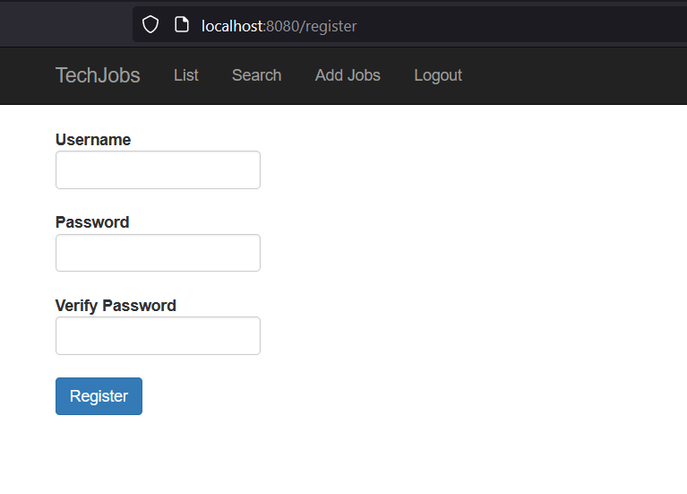
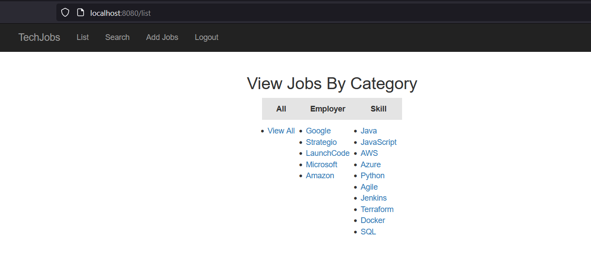
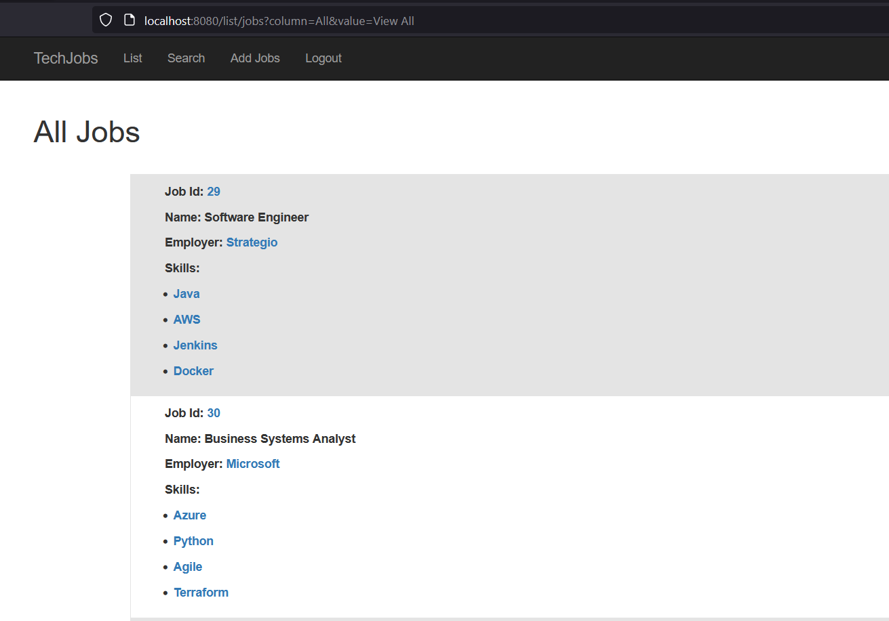

# Tech Jobs

This is an MVC application that helps manage data for currently available jobs in tech. 

This can be used by a Placement Company to match qualified programmers with apprenticeships.

It is a sample Spring Boot application which implements ORM functionality by using Spring Data.

## Technologies
* Java
* Spring Boot
* Thymeleaf templates
* Hibernate
* MySQL Database
* Bootstrap for styling
* Spring Actuator

## Features
* View Available Jobs
* View Jobs by Category
* View Job Details
* Add Jobs
* Add Employers
* Add Skills
* Search for Jobs by Skill, Employer or Keyword

## Running locally
* Fork this repo and clone it to your local machine
* Make sure you have Java installed on your local machine.
* [Set up MySQL on your local machine](https://ladvien.com/data-analytics-mysql-localhost-setup/)
* [Set up a persistent database for the application, similar to this example](https://education.launchcode.org/java-web-development/chapters/orm-part1/background.html#setting-up-a-persistent-database-video)
  * [For best practices, use environment variables to connect](https://education.launchcode.org/gis-devops/configurations/02-environment-variables-intellij/index.html)
* Start the server via **bootRun**
* Navigate to http://localhost:8080

## Screenshots of the app

If using IntelliJ IDEA - Ultimate, add the the Spring Actuator Dependancy to see health of the application

